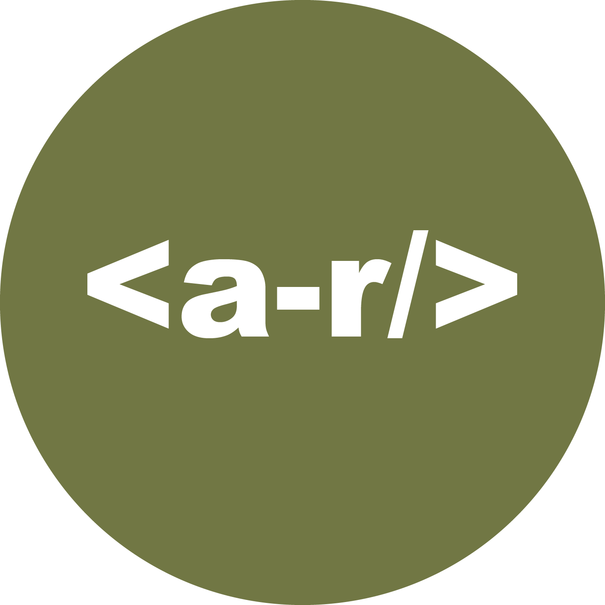

### Autumn Ragland 💖
Hey there! I'm currently a frontend engineer for <a style="color: #717744;" href="https://zip.co/us">Zip (previously Quadpay)</a>, a buy now pay later service. I got my technical education from <a style="color: #717744;" href="https://www.code-crew.org/codeschool">CodeCrew Code School</a>, a Memphis based 6 month coding boot-camp aimed at training adults to be entry level full stack developers.I'm an active member of some of the tech groups in Memphis. I currently serve as a member of the <a style="color: #717744;" href="https://codeconnector.io/">Code Connector</a> leadership board. I regularly attend events hosted by <a style="color: #717744;" href="https://memphiswebworkers.com/ ">Memphis Web Workers</a> and <a style="color: #717744;" href="https://www.linkedin.com/company/gdg-memphis/">Google Developers Group Memphis</a>. I've also had the privilege to participate in <a style="color: #717744;" href="https://www.givecampmemphis.org/">Give Camp Memphis</a> and the <a style="color: #717744;" href="https://memphisdatahack.com/">Memphis Civic Data Hackathon</a>.

### What I'm Up To!
🌟 Currently learning more about accessible web design

💫 Feeling strongest in Vue

💖 Interested to attend more online conferences

🌠 Contact me for tips on transitioning to a career in tech after graduating from a coding bootcamp

### I'm Coding I swear!

